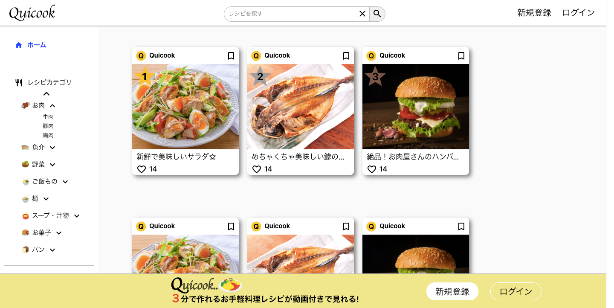

<h1>Quicook</h1>

３分で作れるお手軽料理が動画付きで見れて共有できるアプリケーションです!

🍔ゲストユーザーでのログインもご用意しております!

<h1>使用技術等</h1>
<ul>
 <li>Ruby on Rails(バックエンド)</li>
 <li>Rspec</li>
 <li>React(フロントエンド)</li>
 <li>AWS(インフラ)</li>
 <li>Docker</li>
 <li>ECS/Fargateでコンテナを実行。</li>
 <li>ALBを使ってSSL通信を行なっている。</li>
 <li>Github ActionsでCI/CDを構築。</li>
</ul>
<h2>見ていただきたい点</h2>
<ul>
 <li>ReactとRailsを使用してSPAで構成されている。</li>
 <li>UIにモーダルなどを使用している。</li>
 <li>ECS/Fargateでコンテナを使用してサーバーレスでコンテナを実行している。</li>
 <li>
</ul>
<h1>クラウドアーキテクチャ</h1>

<h2>機能一覧</h2>
<ul>
 <li>ユーザー登録・編集・削除</li>
 <li>ログイン機能</li>
 <li>フォロー機能</li>
 <li>レシピ投稿、動画付きで投稿できる。</li>
 <li>カテゴリ検索</li>
 <li>レシピ名検索</li>
 <li>ブックマーク、いいね機能</li>
 <li>ページネーション機能</li>
 <li>投稿の人気順表示</li>
 <li>パスワードの再設定機能</li>
</ul>

環境構築手順: 
1: git clone git@github.com:reri2525/Quicook.gitでローカルにクローン 
2: docker-compose buildでimage構築 
3: docker-compose run back bundle installでgemのインストール 
4: docker-compose run front sh -c "cd app && yarn add @emotion/react@^11.10.5 @emotion/styled@^11.10.5 @mui/icons-material@^5.11.0 @mui/material@^5.11.3 axios@^1.2.2 react-hook-form@^7.43.0 react-router-dom@5 sass@^1.57.1"でライブラリインストール 
5: docker-compose run back rails db:createでデータベース作成 
6: docker-compose run back rails db:create RAILS_ENV=testでテスト環境のデータベース作成 
7: docker-compose run back rails db:migrateでマイグレーション 
8: touch front/app/src/config.js 
9: docker-compose upでコンテナを起動 